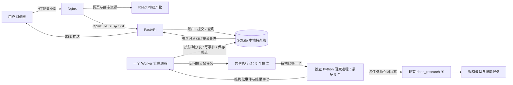
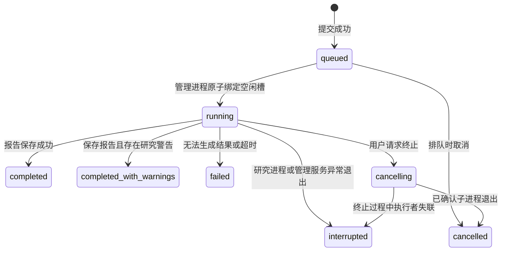

# 问砺 · 深度研究智能体：网页与后端技术方案

> 版本：v0.9（按已确认方案进入开发；实施证据另见 wenli-implementation.md）｜更新日期：2026-10-10（Asia/Shanghai）
>
> 历史源码核查基线：`2211795`；开发起点：`feature/web` / `877ec9b`。第 1.1 节原表保留历史行号，第 3.14 节保留获批适配边界；页面草图见第 3.8 节。前后端与观测适配已进入实现，实际文件及验证证据见实施记录；真实外部 API 和目标服务器验收不能由本地测试替代。
>
> 当前阶段：**2026-10-10 用户明确要求“开始开发”，现按已确认方案实施。**设计确认历史保留；当前实施与验证状态见 [实施记录](wenli-implementation.md)，不能将规划表或已确认方案视为已经验证的功能。
>
> 状态含义：**已确认**来自用户明确回复；**建议**尚未定案；**待验证**必须在开发获准后通过实际运行核实。本文将持续更新，设计决策与变更记录统一保留在第 6 节。

## 1. 背景

### 1.1 现有项目核实

设计启动时，用户的理解基本正确：面向使用者的完整运行入口是 `run.ipynb`，当时尚无网页和 HTTP 后端服务。但核心工作流已经独立封装在 Python 模块中，可以直接作为后端的研究引擎复用；另有只执行“简报＋草稿”的模块脚本入口。本节保留当时的核查背景；本轮新增的 `web/`、`server/` 和部署文件见实施记录。

| 已核实事实 | 源码依据（相对仓库根目录） | 对设计的影响 |
| --- | --- | --- |
| README 指定 Notebook 为运行入口 | `README.md:16`、`:78` | 新增服务入口，无需重写研究算法 |
| 完整图为简报 → 初稿 → Supervisor 子图 → 最终报告 | `deep_research/agent_builder.py:53–69` | 网页阶段必须与真实执行对应 |
| 草稿模块另有独立运行入口 | `deep_research/agents/draft_agent.py:105–135` | “只能通过 Notebook 调用”不完全准确 |
| Notebook 使用 `InMemorySaver`，模块默认图未配置 checkpointer | `run.ipynb:89–95`；`agent_builder.py:69` | 现有 checkpoint 不等于重启后恢复 |
| 子研究在 Supervisor 节点内部通过 `ainvoke`＋`asyncio.gather` 发起 | `deep_research/agents/supervisor.py:230–264` | 需要关联各研究实例，不能只监听顶层节点完成 |
| 草稿精修后调用 evaluator，再进入 Red Team；不是每轮必经 | `supervisor.py:266–319` | 画面按实际事件展开，不能预演固定循环 |
| clarify 只有提示词，未接入主工作流 | `deep_research/prompts/clarify.py`；`agent_builder.py:56–66` | 第一版不新增运行期澄清或审批节点 |
| 捕获工具阶段异常后可能仍生成最终报告 | `supervisor.py:321–328` | 区分完整完成与带警告完成 |
| 部分调用同步执行，且存在模块级配置、模型缓存 | `supervisor.py:270–280`；`deep_research/llm.py:22–64` | 研究执行与 API 进程分离，配置在启动前固定 |

首次初稿仅依据研究简报生成，尚未完成外部资料检索。页面应标注“初始草稿 · 待核验”，不能把它表现为已经验证的结论。质量评估分数属于模型评价，不等同于事实准确率。

本文中的 human in the loop 指**设计方案的多轮人工确认**。它不自动扩展为研究执行中的人工审批功能。

**877ec9b 的差异补充（2026-10-10 静态核查）**：循环参数集中到 `deep_research/iteration_config.py`，Supervisor 上限现为 25，研究并行数 3 和简单/复杂搜索 1/2 次仍属提示词约束。质疑改用 `pending_critiques`，有效修稿并评价完成后消费，空稿或未变化稿保留（`supervisor.py:287–325`）；网页应独立保留质疑历史。`llm.py:46–61` 新增正文为空时回退 `reasoning_content`，最终成稿也会调用该提取函数。用户已确认只展示原引擎实际产出的成果，不暴露模型输出字段来源；来源信息限内部观测，D1 验证此边界，不修改引擎的取值逻辑，详见第 3.14.4 节。

### 1.2 已确认约束

- 产品名称：**问砺 · 深度研究智能体**。
- 第一版用户：自己和少量受邀用户。
- 账号方式：**管理员通过服务器命令创建和管理账号，用户首次登录修改初始密码，之后可自行修改密码**；首版不提供账号管理网页或开放注册。
- 访问范围：**未登录可查看欢迎页；提交研究、查看报告和研究过程必须登录**。普通用户只可访问自己的研究，管理员可查看所有用户的主题、研究过程、阶段产物和报告正文。
- **一次 query 提交创建一个研究任务，成功时生成一篇最终报告**；简报、初稿和修订稿属于该任务的阶段产物。失败或取消可能没有最终报告。
- **多个用户可以同时生成报告，同一用户也可以同时生成多篇报告**，每篇由一次独立提交创建。
- **全站共享的 Worker 池 size = 5**，最多同时执行 5 个报告研究任务；超过容量的任务排队，不为每个用户固定分配 Worker。
- 调度采用**全局 FIFO**；**等待队列最多 10 项，不包含 5 个执行名额**，队列满时明确提示稍后重试。同用户仍允许多任务并发。
- 单任务执行超时为 **1 小时**；从管理进程领取并占用执行槽开始计时，排队时间单独统计。
- **一个 Worker 管理进程按队列向空闲执行槽分发任务**；每个执行 Worker 按本方案定义为一个独立 Python 研究进程，一次处理一个任务。管理进程不计入池容量 5。
- 输入 topic 即开始研究，其他信息选填。
- 视觉方向：**研究书案**，暖白纸感、墨色文字、少量朱砂色，工作区使用协作图。
- 报告交付：**网页阅读＋Markdown 下载**。
- 过程详情：**默认展示协作图，点击节点查看来源、研究成果、草稿和质疑**。
- 成果呈现：**统一展示原引擎实际产出的结果，不向用户暴露 `reasoning_content/content` 等模型输出字段来源**；资料来源的标题、URL 与引用仍正常展示。
- 历史保留：**报告与阶段产物保留至用户删除，详细过程事件从任务结束时起保留 30 天**；完成、终止、失败或中断均按终态时间起算，运行中不清理。事件过期后仍可查看报告与最终协作图，不再支持完整过程回放。
- 终止与故障：**用户可在生成过程中手动终止；手动终止或故障跳出均保留当前生成成果**，包括已保存的阶段产物与可观测的正文片段。正常刷新或关闭网页不取消后台研究。
- 重新生成：**使用新的任务从头生成，原任务和成果保留**；不恢复旧 Agent 状态或 checkpoint，不需要断点续跑能力。
- 后端复用当前源码，仅允许服务化所需的必要适配，不改变研究业务逻辑。
- Welcome 页极简；运行页以图像呈现 Agent 协作、写作与数据流。
- 布局：**桌面采用协作图＋右侧详情，手机以纵向阶段列表为主**。
- 近期用途为**小规模测试**；每日不超过 50 个研究任务保留为容量规划参考，不表示近期会持续满负载运行。5 个执行槽、等待队列 10 项和执行超时 1 小时仍保持已确认设置。
- 服务器、域名、DNS 与备案接入采用**阿里云中国内地方案，备案主体为个人**。具体地域和域名在部署准备时再定。
- **预算部分暂不继续细化**；既有测算只作历史参考，不作为当前投入要求、充值额度或采购决策。

## 2. 目标

### 2.1 第一版建议范围

完整用户路径：管理员创建账号 → 首次登录并修改初始密码 → 输入主题 → 入队并等待空闲 Worker → 观察研究协作 → 阅读报告 → 下载报告 → 我的研究中重新打开或删除已结束任务。

| 目标 | 可验收行为 |
| --- | --- |
| 输入简单 | 首页一个主要输入区与“开始研究”按钮；选填信息默认收起 |
| 过程可信 | 节点状态、分发与返回由真实服务端事件驱动；不模拟百分比或剩余时间 |
| 长任务可靠 | 刷新、断网、关闭网页不取消任务；重新进入可恢复已发生的过程与产物 |
| 可终止且保留成果 | 生成中可手动终止，已保存结果继续可读；故障退出同样保留成果，重新生成从头执行 |
| 并发与成本可控 | 全站共享 5 个执行槽，同用户与跨用户均可并发；幂等提交，支持单任务取消和运行终止 |
| 结果可读 | 中文长文排版、章节导航、引用链接；保留初稿与最终稿区别 |
| 访问权限明确 | 欢迎页公开；普通用户只可读取自己的任务/事件/报告，管理员可读取全部研究内容 |
| 账号可管理 | 管理员创建账号；首次改密在服务端强制执行，用户可自行修改密码 |
| 历史可控 | 详细事件保留 30 天；报告、阶段产物与最终协作图保留到用户删除，事件过期不影响阅读 |
| 可部署 | 独立构建产物、固定依赖、持久卷、HTTPS、启动说明、备份与回滚说明 |

账号、过程展示、保留、终止、恢复、权限、队列与布局已确认，详见第 4.1 节。建议首版不包含：支付、团队协同编辑、知识库上传、用户自带模型密钥、模型选择器、公开报告广场、在线修改研究流程、PDF/Word 导出；采用管理员创建账号，不提供开放注册、邀请链接自助注册或自动断点续跑。

### 2.2 性能与可靠性验收建议

- 在目标服务器和约定测试网络下，创建任务 API 的 P95 响应目标不超过 1 秒；该接口只入队，不等待报告完成。
- 已采集的阶段事件提交后，正常网络下 2 秒内在页面可见；模型长时间没有阶段事件时，显示当前阶段、已耗时和连接状态。
- Worker 池健康且任务未提前完成时，提交 7 个任务，应有 5 个执行、2 个排队；无论 7 个任务来自一个账号还是多个账号，都应满足这一规则。排队位置不泄露他人主题。
- 已有空闲槽时立即分发；某个任务结束并完成进程清理后，即可补入下一项，无需等待同批其他任务结束。正常运行不得超过 5 个执行槽占用。
- 当已有 5 槽占用、10 项等待时，再提交新任务应返回明确的队列已满提示；并发提交不能突破等待上限。原请求的幂等重试仍返回原任务。
- 占槽后满 60 分钟触发超时终止；等待时间不计入执行超时，进程退出清理期间仍占槽，已有成果保留。
- 刷新或断开 SSE 再连接，界面恢复结果一致，事件不重复生成节点。
- 单个研究 Worker 异常退出，仅对应任务进入“执行中断”；其余任务继续运行。管理进程或服务器退出时，按恢复规则处理所有受影响任务，保留已保存成果。
- Notebook 中的“10–20 分钟”只是注释，不作为时长承诺。真实耗时、内存、费用待开发期用固定样例测量。

## 3. 技术方案设计

### 3.1 推荐总体架构

**同一仓库维护、前后端职责分离、单台服务器部署、同一个域名对外提供服务。**



前端负责展示和交互；API 负责登录、任务与数据权限；Worker 管理进程负责调度和监督，池内研究进程负责运行已有 Agent。API 与管理进程使用同一后端代码包、不同启动命令。数据库保存队列、执行槽归属、研究事件和报告。

用户关于“同一台服务器、不同端口或 `/api`”的理解正确。推荐生产环境具体使用：

| 访问地址 | 处理方 | 是否对公网暴露独立端口 |
| --- | --- | --- |
| `https://你的域名/` | Nginx 返回 HTML/CSS/JavaScript；浏览器渲染页面 | 443 |
| `https://你的域名/research/任务ID` | Nginx 返回同一前端入口，前端加载任务 | 同一个 443 |
| `https://你的域名/api/v1/...` | Nginx 转发给内部 FastAPI，例如 `api:8000` | 后端 8000 不直接开放 |
| Worker / SQLite | 服务器内部执行与存储 | 无公网端口 |

DNS 负责把域名指向服务器 IP，Nginx 再按 URL 路径分发请求。不同端口也能实现，但浏览器会将其视为不同源，需要额外处理 CORS；同域名 `/api` 更容易维护。开发时可使用 Vite 的开发代理，生产不运行 Vite 开发服务器。[Vite 官方部署说明](https://vite.dev/guide/static-deploy.html)

### 3.2 技术选型与取舍

| 层级 | 建议 | 选择理由 |
| --- | --- | --- |
| 前端 | React＋TypeScript＋Vite | 适合交互工具，静态部署直接；TypeScript 让事件契约明确 |
| 页面路由 | React Router | 首页、任务工作台、报告、历史记录可直接访问 |
| 协作画布 | React Flow（`@xyflow/react`） | 自定义节点、连线、缩放与选中检查；业务事件决定节点状态 |
| 样式 | CSS Modules＋统一 CSS 变量；必要时使用无样式交互组件 | 为中文研究产品定制视觉，不由整套后台模板决定外观 |
| API | FastAPI＋Pydantic | 直接调用现有 Python 包，定义输入和输出契约，生成 OpenAPI |
| 实时通信 | SSE；REST 提交与取消；轮询兜底 | 当前主要是服务端单向传进度，无需双向 WebSocket |
| 执行 | 1 个管理进程＋容量 5 的研究进程池 | 每槽一次一个报告任务；独立处理各任务的事件、退出、超时和取消 |
| 数据 | SQLite WAL，本地磁盘持久卷，候选方案 | 研究进程通过管理进程集中写入，控制写事务；需以 5 任务事件负载验证容量 |
| 部署 | Docker Compose：Nginx、API、Worker 管理服务 | 管理服务内监督最多 5 个研究子进程；服务数不等于进程数 |

React Flow 提供的是绘图与交互能力，任务树、轮次、角色和数据流语义由应用定义。[自定义节点文档](https://reactflow.dev/learn/customization/custom-nodes)

第一版暂不引入 Next.js SSR、Redis、Celery、Kubernetes 或本地 GPU。5 个研究进程本身不构成必须迁移数据库的理由，关键是事件写入量、读写争用与是否需要多机部署。SQLite 暂保留为候选；若开发期 5 任务负载验证不达标，再评估 PostgreSQL，不先声称容量已验证。独立后台执行是本项目的生命周期选择，不意味着 FastAPI 自带 `BackgroundTasks` 自动具有持久任务队列能力。[FastAPI 官方说明](https://fastapi.tiangolo.com/tutorial/background-tasks/)

**Worker 的术语与进程数量**：worker 是执行工作的角色，并非 Python 中天然等同于“进程”的固定类型；本方案明确选择进程方式实现。执行层为 **1 个管理进程＋最多 5 个研究 Worker 进程**，不包括 Nginx、API 和运行时可能使用的辅助进程。每个研究进程直接执行一项完整报告任务，Supervisor、Researcher、Red Team 等在该任务内部协作，不再为每个角色单独分配一个进程。[Python 多进程官方文档](https://docs.python.org/3/library/multiprocessing.html)

建议将池实现为 5 个固定执行槽，任务到来时启动对应研究进程，完成或终止后回收，下一任务在空闲槽启动新进程。这使模型客户端、图状态和取消边界按任务隔离；池容量保持 5，进程 PID 可以变化，空闲时不必运行 5 个研究进程。管理进程本身不运行研究；也不采用“5 个执行进程各自再启动一个研究进程”这种增加一层执行进程的结构。具体进程库待 D1 验证，不能把某个池库的整体 shutdown 当作单任务取消。

### 3.3 复用源码与适配边界

**保留**现有 prompts、状态合并规则、模型角色、搜索逻辑、Supervisor 决策、Researcher 循环、Red Team、质量评价与报告生成。

| 必要适配 | 建议方式 | 明确边界 |
| --- | --- | --- |
| 服务入口 | 子进程加载配置后导入 `deep_researcher_builder`，构建每次运行的图 | 不复制一份研究流程到后端 |
| 输入 | topic 与选填说明以明确标签组合成原有 `HumanMessage` | 不额外用 LLM 改写主题，不替换已有 prompt |
| 运行标识 | 每任务独立 `run_id` 与 `thread_id`；`recursion_limit` 放调用配置顶层 | 不沿用 Notebook 中固定的 `thread_id="1"` |
| 观测 | callbacks/嵌套事件优先；缺失语义处增加只读观测钩子 | 钩子不改变 prompt、分支、业务状态或返回结果 |
| 结果保存 | 研究进程通过 IPC 将产物交给管理进程持久化 | 不沿用 Notebook 按日期命名、可能覆盖的输出文件 |
| 异常呈现 | 已有捕获异常路径增加结构化警告事件 | 保留其原来继续收尾的行为，网页标注“完成，存在研究警告” |
| 配置 | 启动前固定 `CONFIG_PATH`、`STAGE` 与密钥挂载 | 不按请求改全局环境变量；前端不接触密钥 |

第一版可以延续 Notebook 的每任务内存 checkpointer；任务、事件和产物另行持久化。**浏览器重连恢复展示，不等于研究进程重启后自动接着执行。**用户已确认手动终止或故障退出保留当前成果，重新生成从头开始；首版不实现研究执行的断点续跑，也不增加“继续上次研究”的入口。保存阶段成果用于展示，不意味着下次运行会复用这些成果作为 Agent 状态。

当前 `iteration_config.MAX_CONCURRENT_RESEARCHERS=3` 只写入提示词，代码未做硬并发限流（`iteration_config.py:11–12`；`supervisor.py:120、241–255`）。因此“最多 5 篇报告同时执行”不等于“最多 5 路模型请求”，也不能据此承诺上限是 15 路。每篇内部仍可能并行调用模型和搜索，实际外部请求并发与额度需单独测量。首版保留原研究行为；服务商限额、任务总时长和提交队列上限需纳入容量设计，如需新增内部硬限流，另列适配提案。

### 3.4 如何获得真实研究事件

LangGraph/LangChain 提供图状态、模型消息和子图事件能力，但当前代码存在节点内部的手动调用，不能只监听最外层 `updates`。具体采用的流式 API 必须依据开发期锁定版本验证，不能把最新文档的接口直接当作仓库最低版本的能力。[LangGraph 官方 streaming 文档](https://docs.langchain.com/oss/python/langgraph/streaming)

采集路径：框架事件或只读钩子 → 后端事件适配器 → 脱敏与业务事件归一化 → 各研究进程独立 IPC → 管理进程按任务持久化 → API SSE → 前端状态更新。

| 页面活动 | 可依赖的现有执行点 | 必要补充 |
| --- | --- | --- |
| 简报与初稿撰写 | `write_research_brief`、`write_draft_report` | 开始、完成、产物事件 |
| Supervisor 分发 | 返回的 `ConductResearch` 调用与实际启动处 | 使用 `tool_call_id` 关联分发和研究实例 |
| 子 Agent 研究 | 每个 `researcher_agent` 的 `llm_call/tool_node/compress_research` | 独立实例 ID、父 ID、轮次 |
| 检索与来源 | 搜索工具调用及其结果 | 捕获真实 URL、标题；不靠解析最终报告反推全部过程 |
| 草稿修订 | `refine_draft_report` 工具调用 | 保存草稿版本，关联输入证据与输出产物 |
| 质量评估 | 普通函数 `evaluate_draft_quality` | 必要时在函数边界补开始/完成事件，它不是现有独立图节点 |
| Red Team 质疑 | `red_team_node` | 区分产生质疑、无新增意见、因条件跳过 |
| 最终成稿 | `final_report_generation` | 保存完整结果后发布完成状态 |

`ConductResearch` 的实际执行是直接调用研究子图，不保证产生对应 `on_tool_start`；必须验证事件的真实来源。捕获后被吞掉的异常也不保证冒泡到顶层，需要在原捕获点观测。禁止通过正则解析 stdout 驱动页面。

展示内容白名单：任务主题、阶段名、检索活动、资料来源、阶段成果、公开质疑与模型评分。默认不额外传输系统提示词、完整内部消息、原始 `reasoning_content` 增量、`think_tool` 参数/回声及聚合 `notes/raw_notes`。用户已确认：引擎实际选为阶段成果的内容统一作为结果展示，不添加模型输出字段来源标签、提示或专属警告；内部观测与用户接口分离，详见第 3.14.4 节。该约定不构成对既有报告语义的过滤保证。阶段描述由事件模板生成，不新增一个 LLM 来“解说”过程。

### 3.5 事件契约草案

每条持久事件包含：`schema_version`、`run_id`、单任务递增 `seq`、`event_id`、`type`、`timestamp`、`agent_instance_id`、`parent_instance_id`、`iteration`、`payload`；按需包含 `tool_call_id`、`artifact_id`。框架自身的 callback run ID 与网站任务 ID 分字段保存。

主要事件：`run.queued`、`run.started`、`stage.started`、`stage.completed`、`research.dispatched`、`research.started`、`research.completed`、`source.discovered`、`artifact.created`、`quality.evaluated`、`critique.created`、`research.warning`、`run.completed`、`run.failed`、`run.cancelled`、`run.interrupted`。`run.completed` 包含 `has_warnings`。

此处是面向浏览器的业务事件协议，不能直接透传内部观测事件。模型输出字段来源仅作服务端内部元数据，不进入公开 `payload`、历史回放或图快照；仅发生字段回退不设置 `has_warnings`，也不生成用户可见的 `research.warning`。检索异常、摘要失败等真实研究问题仍按既有规则给出面向用户的原因说明。

协议示意，**不是当前实现**：

```json
{
  "schema_version": 1,
  "run_id": "<任务 UUID>",
  "seq": 18,
  "event_id": "<事件 UUID>",
  "type": "research.dispatched",
  "timestamp": "<UTC ISO-8601>",
  "agent_instance_id": "research-<调用ID>",
  "parent_instance_id": "supervisor-<实例ID>",
  "iteration": 2,
  "tool_call_id": "<模型返回的工具调用ID>",
  "payload": {"topic": "<真实分发的研究主题>"}
}
```

`seq` 表示持久化顺序，不冒充所有并行活动的因果顺序；父子 ID 和调用 ID 表示关联。角色名不能代替实例 ID，相同主题也不能合并不同轮次的任务。长文本产物通过 `artifact_id` 获取，事件中不反复发送整篇报告。首版以阶段事件和产物为基础；若能观测到用户可见正文的增量，也须保存为部分产物，逐 token 动画展示仍为可选项，不以伪造打字效果代替真实流。该增量采集不包含内部推理或未解析的工具调用原文。

### 3.6 任务生命周期与排队



- **领取与容量**：管理服务单实例锁＋数据库短事务原子分配。事务内取得一个空闲槽，把队首 queued 任务绑定至该槽并置为 running，同时记录独立执行标识与管理进程代次；没有空闲槽就保留 queued。预留、启动、执行、取消和退出清理期间均占用槽，不因刚提交任务终态就提前释放；最多 5 槽占用。running 可显示子阶段“准备研究环境”。进程启动失败时完成清理、记 failed 并释放该槽，不遗留永久 running。
- **幂等**：创建任务带客户端生成的 `Idempotency-Key`；按用户与键唯一约束，同键同内容返回同一任务，同键不同内容返回冲突。
- **调度与用户关系**：已确认全局 FIFO，以提交时间和稳定序号排序，有空闲槽即可分发。同一用户允许占用多个槽，甚至占用全部 5 槽；不新增每用户串行限制，不将账号和固定 Worker 绑定。
- **等待队列容量**：已确认最多 10 个 queued 任务，不含最多 5 个已占执行槽的任务。API 在同一短事务内先查幂等键，再检查队列容量并入队；队列满返回 `429 / QUEUE_FULL`，不创建任务、不调用模型。仅同一次提交的重试可复用幂等键；前端提示稍后再试，不静默循环提交。并发入队与领取使用一致的事务规则，避免检查后插入导致超额。
- **一次提交与幂等**：同一用户主动再次提交相同 topic，可以生成另一篇报告，必须使用新的提交键；只有同一次提交的网络重试复用幂等键并返回同一 `run_id`，不能按 topic 文本去重。每项任务最多一份最终稿，阶段稿版本不计为多篇报告。
- **独立执行**：API 不运行整套 Agent，管理进程不执行研究函数。每个研究进程有独立图状态、客户端、运行 ID 和 IPC 通道，stdout 留给日志。管理进程并行监听各通道和退出信号，不能阻塞等待一个任务结束后才调度或采集其他任务；有界事件缓冲、独立控制通道与公平处理确保高事件量任务不饿死其他任务或取消请求。
- **手动终止**：排队任务立即取消；运行任务先 cancelling，管理进程通过控制通道请求停止并接收本任务已产生的产物，宽限期后仍未退出则强制结束本任务进程组。确认退出、处理已接收的产物并提交终态后才 cancelled 和释放槽。同步调用无法及时响应时，仍以之前持续保存的成果为基础；不为终止额外调用模型补写总结。终止一篇不停止整个池，也不影响同一用户的其他报告。已经发给服务商的请求与费用不保证撤回。
- **终止与删除分开**：终止只停止执行，不删除任务记录、来源、草稿、部分正文或协作图。删除必须由用户另行发起，并满足任务结束与进程清理条件。
- **取消竞态**：成功完成和取消请求通过数据库条件更新串行裁决；完成先提交则保留完成，取消先提交则不再提交成功终态。取消收尾期间接收的有效产物应保存，已冻结的任务终态不得被迟到的成功结果改写。
- **心跳**：建议管理进程每 5 秒更新心跳，30 秒无心跳视为可疑；另记录每个槽的执行标识、进程存活与最后进度时间。模型没有新进度不等于进程死亡。先确认旧执行者停止，再复用对应槽，不能仅因数据库锁等待或心跳延迟就重复启动任务。
- **退出与恢复**：单研究进程异常退出时，管理进程仅处理该任务为 interrupted 并回收该槽，其他 4 槽不受影响；API 重启不影响管理服务。管理服务崩溃后由容器运行时清理所属研究进程，重启时先确认旧执行者全部停止，恢复槽表，只将旧代次遗留的 running/cancelling 项标记 interrupted。已提交的 completed/failed/cancelled 等终态保留；queued 项继续等待。已执行项不自动重跑，用户重新生成时创建新 `run_id` 并关联原任务。
- **超时**：已确认单任务执行上限为 60 分钟，从管理进程领取并占槽起计，包含执行环境启动，不包含排队时间；使用单调时钟监控。达到上限触发终止，退出宽限与清理可能短暂超出计时阈值，仍须确认进程组退出后才能提交带 `TIMEOUT` 原因的 failed 终态并释放名额。不能先置 failed 就启动下一篇。外层监控不改原研究路由，不能承诺限时内必然完成。每次领取分配独立执行标识，迟到的事件与结果必须匹配当前执行标识且满足状态条件，避免旧执行者覆写终态。
- **产物一致性**：最终报告、任务终态与完成事件在同一个数据库事务中提交，前端看到“已完成”即可读报告。数据库故障时停止领取新任务，当前任务不得宣告完成；采用有界缓冲与明确失败处理，避免无限积累内存。

**当前成果保存与从头重试契约**：

1. 研究进行中持续保存简报、已完成子研究成果、资料来源、草稿版本、质疑和协作图。可通过现有回调观测到的用户可见正文片段也保存为部分产物，不能等整个任务成功后才一次性落库；产物在界面标为“已保存”前必须完成持久化。
2. 产物区分 `partial` 与 `complete`，保留所属阶段、版本及最后保存时间；内容完整性与任务状态分开，完整初稿仍是完整的阶段稿，不因任务中断一律变为 partial。手动终止为 cancelled，执行进程异常退出为 interrupted，明确运行错误或超时为 failed；这些终态都保留已保存成果。取消已先接受时，收尾期间晚到的完整报告可作为产物保存，任务仍保持 cancelled；未完成正文不得冒充最终报告或“已完成”任务。
3. 管理进程仍存活时，研究进程退出后对该执行标识下的 IPC 消息做有时限的排空，保存已收到的完整有效产物，再冻结展示快照和终态；强杀留下的不完整消息帧不能无限等待。管理进程或服务器突然退出时，以最后成功持久化的数据为恢复边界。模型尚未返回、仅在进程内存中且尚未落盘的内容不能保证恢复。D1 必须验证现有调用可观测的部分文本范围，结构化输出未形成可读结果时保留上一份有效产物，不展示原始 JSON 残片。
4. 用户点击“重新生成”，创建新的 `run_id`、`thread_id`、执行标识及初始图状态，只复用用户的 topic 和选填说明，从研究简报开始执行。`retry_of` 仅用于关联历史，不导入旧 notes、草稿、最终正文、消息历史或 checkpoint；旧任务不清空、不复活、不覆写。
5. 若尚未形成任何产物就终止，保留任务记录和已有过程状态，页面说明“尚未生成可查看的成果”，不能伪造报告。超时与明确失败沿用同一成果保留原则；用户选择重新生成仍按新任务排队。

### 3.7 存储模型与实时接口

| 表/实体 | 关键内容 |
| --- | --- |
| `users` | 用户 ID、账号、密码哈希、角色、启用状态、`must_change_password`、密码变更时间 |
| `sessions` | 会话令牌哈希、用户、过期时间；令牌原值仅由安全 Cookie 持有 |
| `research_runs` | 用户、topic、选填说明、状态、队列时间、起止时间、当前阶段、警告标志、幂等键、重试来源、执行标识/管理代次、`snapshot_json/snapshot_seq`、详细事件保留截止时间与回放可用状态 |
| `worker_slots` | 固定 5 行，槽 ID、idle/starting/running/stopping/cleanup、当前任务、执行标识、管理代次；当前任务唯一约束，保证一次只分配一个槽 |
| `research_events` | `run_id + seq` 唯一索引、事件类型、实例关联、时间、白名单 JSON 数据 |
| `research_artifacts` | 简报/初稿/修订稿/子研究成果/质疑/最终稿及可读正文片段，版本、`partial/complete`、最后保存时间、Markdown 正文、可空的来源事件引用；事件到期不能级联删除产物 |
| `research_sources` | 实际观测到的 URL、标题、研究实例关联；同一来源可对应多个任务阶段 |

报告作为 SQLite TEXT 保存，下载时返回 UTF-8 Markdown；文件名含任务短 ID，避免同日覆盖。来源清单属于“已检索来源”，不能自动宣称每条都被最终正文引用；正文引用沿用模型实际输出，首版不新增引用重写算法。

每个影响展示的事件，与其更新后的简洁协作图快照和 `snapshot_seq` 同事务提交。快照保留节点关系、最终状态、阶段产物引用及必要计数，不依赖保留所有原始事件；详细事件过期后仍可打开成果与最终图，但无法完整回放每一步。持久事件的 `seq` 由同一任务的事务性计数分配，API 和管理进程同时产生事件也不会重号。

**已确认的保留与删除规则**：

- 报告、阶段产物保留到所属用户删除。为支持过期后的阅读与最终图，任务记录、来源目录、必要节点摘要、质疑产物和最终协作图快照随任务保留，不随详细事件一起过期。
- 手动终止、故障中断或失败任务中的已有产物与部分正文，采用相同的保留规则；终止状态本身不触发删除。此类任务的协作图保留停止时的状态，不把未执行阶段补画为已完成。
- 详细过程事件已确认从任务结束时起保留 30 天，覆盖 completed、completed_with_warnings、cancelled、failed、interrupted；执行中不清理。以持久化的 `finished_at + 30 天` 为截止，刷新页面、重复取消请求和清理重试不延长保留期；重新生成的新任务单独计时。到期后关闭完整回放入口，明确提示“详细过程已过期”，仍可打开报告、各阶段产物和最终图。
- 清理作业只删除到期的详细事件，短事务分批执行，先确认独立快照和产物已持久化。产物与事件的溯源关系采用可空引用或 `ON DELETE SET NULL`；不得因事件清理级联删除报告、来源或快照，也不得依赖已清理事件才能展示节点详情。
- 用户主动删除已结束且执行槽已释放的任务时，清除该任务及其关联产物、事件、来源和快照；运行或清理中的任务先完成终止与进程回收。
- 备份副本按独立的备份保留期限到期，具体期限仍待部署阶段确定；30 天在线事件规则不等于已经承诺同期限清除所有备份。恢复备份后应先重新应用保留规则，再开放读取。

SQLite 使用 WAL、短事务、`busy_timeout`、外键与唯一约束。API 和管理进程访问的数据库位于**同机本地持久卷**，不能放在 NFS 上；SSE 每次读取后立刻释放事务，不能维持与长连接等长的读事务。部署时核对实际 SQLite runtime 含 WAL-reset 修复（3.51.3 或官方明确列出的修复回移版），不能只检查 Python 版本。[SQLite 官方 WAL 说明](https://sqlite.org/wal.html)

5 个研究进程不直接连接或写入数据库，其事件由管理进程内的单一写入通道集中持久化；API 创建、取消任务等仍会写库，因此不能声称整个系统只有一个写入者。需要验证 5 任务同时产出事件时的短事务争用、SSE 延迟、IPC 积压与快照开销；若不达标再评估数据库调整。持久任务表是队列真相来源，进程内 IPC 只传递运行消息，不能替代持久队列。

接口草案（均以 `/api/v1` 为前缀）：

| 方法与路径 | 职责 | 关键结果 |
| --- | --- | --- |
| `POST /auth/login` | 登录 | 建立 HttpOnly 会话 Cookie；需首次改密时只建立受限会话 |
| `POST /auth/logout` | 注销 | 服务端撤销会话 |
| `POST /auth/change-password` | 首次或日常修改密码 | 校验当前凭证，更新哈希，解除首次改密标记，轮换当前会话并撤销其他会话 |
| `GET /auth/me` | 当前用户 | 用户、角色及 `must_change_password`，不返回凭证 |
| `POST /research-runs` | 创建任务 | `202`，返回 ID、状态、工作台地址；不等待 Agent |
| `GET /research-runs?scope=mine` | 当前用户的任务列表，默认范围 | 游标分页；状态、时间、主题 |
| `GET /research-runs?scope=all` | 管理员查看全部研究 | 后端要求管理员角色；可按用户、状态和时间筛选 |
| `GET /research-runs/{id}` | 任务快照 | 状态、节点摘要、产物索引、`last_event_seq` |
| `GET /research-runs/{id}/events` | SSE | 按序补发后继续推送；支持游标 |
| `GET /research-runs/{id}/events/history?after=...` | 分页事件查询 | 回放与 SSE 失败时的轮询兜底 |
| `GET /research-runs/{id}/artifacts/{artifact_id}` | 阶段产物 | 类型、版本、正文 |
| `GET /research-runs/{id}/artifacts/{artifact_id}.md` | 下载完整或部分阶段产物 | 文件名和正文元信息标明阶段及未完成状态 |
| `GET /research-runs/{id}/report` | 最终报告 | Markdown 与完成状态 |
| `GET /research-runs/{id}/report.md` | 下载 | 鉴权后的 Markdown 附件 |
| `POST /research-runs/{id}/cancel` | 取消/手动终止 | 幂等；返回实际状态，保留已有产物 |
| `DELETE /research-runs/{id}` | 删除已结束且执行槽已释放的任务 | 删除所属事件/产物/来源/快照；执行或清理中暂不允许删除 |
| `GET /health/live`、`GET /health/ready` | 部署检查 | 存活、数据库可用、迁移与 Worker 状态；不回显配置 |

“重新生成”复用创建接口，附 `retry_of`，使用新的幂等键创建从头执行的新任务，不覆写旧记录；`retry_of` 对目标任务进行权限校验，不能用它绕过内容访问范围。未产生完整最终报告时，最终稿接口返回明确“最终报告不可用”状态，由产物接口提供草稿和部分正文，不能拿部分内容代替成功的最终稿。错误包统一为 `code/message/request_id/retryable`；字段错误、未登录、无权限或不存在、额度限制、服务暂不可用分别提供明确状态。登录/下载/SSE 都必须在后端检查权限，不能只在页面隐藏入口。

研究内容读取规则统一为“任务所属用户或管理员”，覆盖任务快照、事件查询与 SSE、来源、阶段产物、最终稿和下载；管理员即使先访问普通详情 URL，也必须通过同一权限检查。跨用户读取的授权不自动扩展为修改、取消、删除他人任务，首版这些写操作仍限任务所属用户；管理员账号管理独立处理。

所有用户接口使用明确的响应字段白名单，统一排除模型输出字段来源等内部观测元数据；范围覆盖 REST、SSE、历史事件、快照、阶段成果、报告与 Markdown 下载，管理员网页也遵守同一展示规则。不能把内部字段先发给浏览器再仅靠组件隐藏。资料 URL、标题、引用和任务重试来源不属于这类内部来源信息，按原功能保留。

并发查询始终以任务为单位：列表可以返回同一用户多个 running/queued 项，快照、事件、取消、产物和下载都绑定具体 `run_id`。`user_id` 只用于所有权与授权，不能作为“该用户当前唯一任务”的缓存键。每个工作台订阅自己的 SSE；我的研究列表定期刷新状态摘要，无需订阅所有任务的完整事件流。健康检查区分管理服务状态、可用槽位和故障槽位，5 槽繁忙属于正常负载，不应报为服务不健康。

**重连协议**：先获取同一读事务内的快照与 `last_event_seq=N`，再订阅 `events?after=N`。初次使用查询游标，重连使用 `Last-Event-ID`，按任务验证游标并取有效最新位置。服务端先查询并发送已提交的 `seq>N` 事件，再继续短查询等待新事件；前端按 `(run_id,seq)` 去重。状态快照和事件之间不能留读取空隙。

SSE 建议每 15 秒发送非持久化心跳；终态事件收到后前端主动关闭 EventSource。首次进入已完成任务直接展示报告；若历史事件过期，明确返回“历史已截断”，重新获取快照，不能伪装为完整过程回放。退避重连期间显示连接异常；轮询只读，不驱动 Agent 执行。[SSE 协议参考](https://developer.mozilla.org/en-US/docs/Web/API/Server-sent_events/Using_server-sent_events)

### 3.8 页面与交互设计

#### 3.8.1 已确认的轻量页面设计

本节所有视觉效果方案已于 2026-10-10 获用户确认，作为首版实现基准。设计阶段以文字线框呈现四个主要页面与关键状态；用户随后授权开发，已实现网页并进行浏览器验收。以下线框示例主题、轮次、来源数、时间均为布局占位，不表示真实运行结果；实际验收见实施记录。

已确认视觉方案：暖白背景、墨色文字，朱砂色用于主要操作及当前活动；标题有中文宋体气质，正文与控件使用清晰的无衬线。Welcome 输入区约 640px 宽；桌面工作台将剩余宽度交给协作图、详情栏约 320–360px；报告正文以约 760px 阅读宽度为起点。桌面正文 16–18px、行距约 1.7–1.8。以上作为首版视觉基准，在对应范围内按屏幕适配，不增加品牌动画或装饰页面。

| 页面 | 建议路径 | 主要功能 |
| --- | --- | --- |
| Welcome | `/` | 公开的品牌、主题输入、选填说明与示例；私人历史仅登录后展示 |
| 登录 | `/login` | 管理员创建的账号登录；首次登录先改密，正常登录回到原页面 |
| 首次修改密码 | `/change-password` | 修改初始密码后进入研究功能；账户菜单另提供日常改密入口 |
| 研究工作台 | `/research/:runId` | 排队状态、协作图、节点详情、阶段产物、终止入口 |
| 报告阅读 | `/research/:runId/report` | 章节目录、正文、引用、Markdown 下载、回看过程 |
| 我的研究 | `/history` | 自己的运行中、排队中与历史报告；管理员额外有“全部研究”视图 |

**同用户多任务交互**：一项研究进行中时，“新建研究”和 Welcome 提交入口继续可用；提交按钮的短暂禁用仅防止同一次请求重复发送。我的研究同时显示各任务状态，进入另一任务或关闭标签页不影响原任务执行。草稿输入、前端缓存、图状态、事件游标与请求取消句柄都按 `run_id` 隔离；同一主题多次提交也显示为不同任务。

**访客与管理员交互**：访客可浏览欢迎页并填写主题，点击“开始研究”时引导登录；登录与必要的首次改密完成后返回输入页，临时保留未提交内容，由用户提交创建任务。未登录页不显示他人的主题或历史报告。管理员在研究列表切换“我的研究/全部研究”，进入他人任务可查看过程和产物，跨用户视图为只读；无需为这项内容读取能力引入一整套账号管理后台。

顶部账户菜单提供修改密码弹窗，首次登录进入强制修改页；历史记录的任务菜单提供删除已结束且执行槽已释放任务的入口与确认提示。运行任务先展示终止操作，不提供会留下运行进程的直接删除。

过程详情的默认方式已确认：先看协作关系与阶段状态，点击节点后展开来源、研究成果、草稿和质疑。详细事件过期后保留最终图与节点产物的阅读入口，隐藏或禁用完整回放并说明原因。布局已确认桌面“协作图＋右侧详情”、手机纵向阶段列表为主；尺寸、折叠与视觉效果按本节已确认方案实现。

**终止后的界面**：生成过程中提供“终止生成”，说明已保存成果会保留；点击后显示“正在终止”，由服务端确认结束后显示“已手动终止”。故障中断显示对应原因与最后保存时间。两类状态都保留协作图和成果入口，提供“查看已有成果”“下载阶段成果”“重新生成”；部分正文标为“未完成”。“重新生成”明确说明从头开始并创建新任务，原记录仍可查看。此处不提供“继续生成”或“恢复进度”按钮；页面重新连接仍可加载旧任务已保存的内容。

Welcome 线框（结构已确认，非已实现页面）：

```text
问砺 · 深度研究智能体                         我的研究 / 账户

                 你想把什么问题研究透？
          从一个问题出发，形成有依据的调研报告。

          ┌──────────────────────────────────┐
          │ 输入想研究的主题或具体问题……       │
          │                                  │
          └──────────────────────────────────┘
          ＋补充研究目的或范围        [开始研究]
          试试：技术路线比较 / 行业研究 / 产品决策

          最近研究（登录且有记录时简洁显示）
```

示例只是可填入的真实研究题型，不伪造报告成果或产品指标。只设一个主要操作；中文输入法组合输入期间 Enter 不提交，建议 Ctrl/Cmd+Enter 提交，Enter 保留换行。选填内容为研究目的、范围或偏好的读者描述，作为原始需求附加；不做会暗中改模型参数的“深度滑块”。

工作台线框（任务仍运行时也能新建另一项研究）：

```text
问砺                  我的研究        [新建研究]    账户
研究主题示例                  研究中 · 已耗时       [终止生成]
简报 → 初稿 → 研究与修订 → 最终报告                 连接正常
┌───────────────────────────────────┬──────────────────────┐
│                                   │ 当前选中研究          │
│       Supervisor 分发主题         │ 主题、状态、已耗时     │
│        ↙    ↓    ↘                │                      │
│   研究 A  研究 B  研究 C            │ [成果] [来源] [活动]  │
│        ↘    ↓    ↙                │ 当前节点相关内容       │
│        成果返回 Supervisor         │                      │
│              ↓                    │ 版本与保存时间         │
│        草稿修订 → 评估 → 红队      │                      │
│              ↖ 反馈到 Supervisor  │                      │
└───────────────────────────────────┴──────────────────────┘
阶段产物：研究简报 / 初始草稿 / 修订稿 / 最终报告
```

上述 A/B/C 仅用于解释布局，运行时数量和轮次完全来自真实事件。修订、评估与红队按实际调用出现；回路表示反馈关系，不是每项任务都会执行的固定顺序。简报/草稿/报告归类为文稿，Researcher 归类为执行者；线条标明“分发主题”“返回成果”“质疑反馈”。画布为过程展示，不提供用户拖线改工作流的编辑功能。

**协作图呈现规则**：

- 主干固定为“简报—初稿—研究与修订—最终报告”，研究区按轮次展开。
- 实线箭头表示任务分发；另一种明确标注的线型表示证据返回；反馈线表示质疑进入下一轮。颜色之外还提供标签和方向。
- 研究节点显示短主题、角色、状态、来源数；详情面板显示完整主题和阶段产物。节点位置稳定，不随每条事件随机重排。
- 只有对应活动正在执行时连线短暂流动，完成后静止；“证据汇总”是成果关系的视觉分组，不假称新增了一个 Agent。
- 草稿与报告作为可打开的文稿产物节点；修订产生新版本，不把旧稿直接覆盖后失去轨迹。
- Red Team 与评分按实际调用出现，允许“无新增意见”或“跳过”。评分标签写“模型评估”，不写“准确率已达 X%”。
- 历史轮次折叠，首屏重点显示当前活动；默认不展示全部内部调用树和 token。
- 阶段加已耗时表达进度；无实测依据时不显示整体百分比、预计完成时间或“还剩几秒”。
- 移动端默认使用可展开的纵向协作阶段列表，保留查看关系图入口；图外页面不横向溢出。窄屏不强塞桌面三栏。

报告阅读采用独立长文页面，桌面有章节目录，手机为目录按钮；正文控制中文行长和行距，支持表格、代码、链接与长 URL 换行。完成后提供明确“阅读报告”操作，不突然跳走正在查看的节点。初稿、研究警告和最终报告各有明确标签。

报告页线框：

```text
← 返回研究过程                           [下载 Markdown]
报告题目
已完成 / 存在研究警告                     生成时间
┌────────────┬────────────────────────────────────────┐
│ 章节目录   │ 摘要与主要结论                         │
│ 1. 背景    │                                        │
│ 2. 比较    │ 正文、表格、引用链接                   │
│ 3. 建议    │                                        │
│ 参考资料   │ 模型评估属于参考信息，按需展开          │
└────────────┴────────────────────────────────────────┘
```

我的研究线框（管理员才显示“全部研究”）：

```text
我的研究  [全部 / 运行中 / 排队中 / 已结束]     [新建研究]
范围：我的研究 / 全部研究（管理员）
主题示例 A     研究中    第 N 轮              [打开] [终止]
主题示例 B     排队中    前方 N 项            [打开] [取消]
主题示例 C     已完成                         [阅读] [更多]
主题示例 D     已中断    已保留阶段成果        [查看] [重新生成]
```

列表主要展示当前用户任务摘要，管理员在全部研究视图可看到所属账号，但他人任务不出现终止或删除按钮。已结束任务的“更多”提供删除；重新生成保留原记录。账号管理仍通过服务器命令完成。

#### 3.8.2 手机布局和关键交互状态

手机首页保持单列输入；研究页按“状态摘要 → 阶段列表 → 展开的当前节点 → 阶段产物”自上而下排列，顶部始终有返回与终止入口。节点详情就地展开或用底部详情面板，不挤成桌面两栏。报告目录收为按钮，另提供“查看关系图”入口。

| 状态 | 页面表现 | 主要操作 |
| --- | --- | --- |
| 未登录 | 可看 Welcome 和填写主题，登录后返回输入页 | 登录；登录过程不偷偷新建任务 |
| 首次登录 | 简洁改密表单，通过后进入研究功能 | 保存新密码 |
| 正在提交 | 按钮暂时禁用，不清空主题 | 等待本次提交响应 |
| 队列已满 | 输入原样保留，明确提示等待队列已满 | 稍后手动重试 |
| 排队中 | 显示排队位置，不估计未经验证的剩余分钟数 | 取消排队、新建其他研究 |
| 运行中 | 当前节点高亮，边线仅在真实活动时短暂流动 | 看节点详情、终止生成 |
| 正在终止 | 停止按钮禁用，说明正在保存已收到的成果并停止执行 | 查看已有成果 |
| 已终止/中断/失败 | 保留停止位置与最后保存时间，部分正文标“未完成” | 查看/下载成果、从头重新生成 |
| 已完成/带警告完成 | 显示报告入口，有警告时不隐藏其原因 | 阅读报告、下载 Markdown |
| 连接中断 | 保留当前画面，提示“连接恢复中”，不宣称研究失败 | 自动重连或手动刷新 |
| 详细事件已过期 | 可看最终图与文稿，提示无法完整回放 | 阅读已保留成果 |

本节确认范围包括：输入页极简、研究页图为主、报告页阅读为主、我的研究列表管理多个任务；节点详情与文稿以点击展开为主，以及上述字体、间距、关系线、状态动效和手机布局方案。实现与实际浏览器验收仍待开发获准后进行。

### 3.9 视觉方向与参考

**已确认方向：研究书案。** 欢迎页像一张干净的提问纸，工作台像研究材料逐渐组织起来的书案，报告页以阅读为中心。品牌记忆点来自中文排版、文稿形态和协作关系，而非堆叠装饰。

以下是查阅到的参考与本项目的设计推导，并非“全网最流行风格”的统计排名：

| 方向 | 可参考对象 | 借鉴内容 | 当前结论 |
| --- | --- | --- | --- |
| 研究书案 | 本项目原创方向；结合内容优先、弱化导航的原则 | 暖白、墨色、朱砂重点；中文文稿排版，纸页与批注意象 | 用户已选择 |
| 精密工作台 | [Linear 2026 年界面调整](https://linear.app/now/behind-the-latest-design-refresh) | 减轻侧栏视觉重量、稳定操作位置、降低边框噪声 | 借鉴工作区的信息层级，不复制整体皮肤 |
| 技术画布 | [Vercel Geist](https://vercel.com/geist/introduction) | 清晰字体层级、高对比色彩、网格秩序 | 作为备选；不作为当前视觉主线 |

待下一轮细化的视觉参数建议：

- 背景暖白 `#F7F4ED`，文稿面 `#FFFEFA`，主文字墨色 `#252723`，强调朱砂 `#A23E32`；成功和警告另设语义色，不能把朱砂同时当所有状态色。以上为候选 token，开发时实测对比度。
- 中文展示标题使用适度宋体气质；正文和控件用清晰的中文无衬线；任务序号和耗时可用等宽字体。字体优先系统可用栈，若需自托管字体则确认许可、字重和体积。
- 用留白、细分隔和文稿边缘区分层次；纸感主要由底色与排版体现，避免铺大幅纹理影响阅读。
- 圆角和阴影克制；朱砂主要用于当前活动、关键操作和品牌细节。研究结果本身是页面重点。
- Welcome、工作台、报告页分别采用提问纸、协作画布、长文阅读三种结构，保持同一设计语言。
- 动效只解释状态变化；尊重 `prefers-reduced-motion`。图形同时提供文字列表和键盘访问，状态不只依赖颜色。

第 3.8 节文字线框、状态表与视觉效果已获用户确认。按用户要求保持轻量，不另做 demo 或高保真原型；后续若有具体视觉修改，再针对性调整。

### 3.10 账户、权限与运行边界

**已确认采用管理员创建账号＋用户修改密码的账号制。** 用户首次登录修改初始密码，之后可从账户菜单修改密码。密码只存安全哈希，使用 HttpOnly、Secure、SameSite Cookie；状态变更接口校验 CSRF 和 Origin，会话可撤销。

首次改密必须由 API 检查 `must_change_password`：受限会话仅能访问当前用户、修改密码和注销接口，不能通过直接调用 API 提交、读取或订阅研究任务。成功改密后更新哈希与标记，轮换当前会话并撤销其他会话；只做前端跳转不能满足该要求。

账号创建、禁用与重置已确认通过服务器管理命令完成，首版不做账号管理网页。用户自己的首次及日常改密仍在网页完成。拟新增 `server/admin_cli.py`，提供创建、列出、禁用/启用、重置密码入口；这是目录与能力规划，当前没有可执行命令。初始/重置密码用隐藏交互输入或一次性输出，避免明文放进命令参数与日志。重置后撤销会话并要求再次改密；首版不接短信、邮件或第三方登录。管理员读取全部研究内容通过研究列表与既有详情页完成。

**已确认的访问矩阵**：

| 能力 | 未登录 | 普通用户（已完成首次改密） | 管理员（已完成首次改密） |
| --- | --- | --- | --- |
| 欢迎页与公开示例 | 允许 | 允许 | 允许 |
| 提交研究 | 引导登录 | 允许，以本人账号创建 | 允许，以本人账号创建 |
| 主题、过程、阶段产物、报告与下载 | 不允许 | 仅自己 | 所有用户 |
| 取消或删除任务 | 不允许 | 仅自己 | 仅自己的研究；本轮未授予跨用户写权限 |
| 创建账号与账号管理 | 不允许 | 不允许 | 通过服务器管理命令完成；网页管理员角色本身不授予服务器登录权限 |

任务、事件、产物和下载统一在后端检查所有权或管理员角色，不能因为猜中 ID 或修改 `scope` 就越权。管理员查看全部内容的授权已由用户明确选择；账号登录及首次改密限制同样适用于管理员。

服务端保存模型与搜索配置，Worker 以只读方式挂载；API 不需要模型密钥。当前 YAML 加载不会自动替换 `${ENV_VAR}`，部署说明必须使用真实支持的配置加载方式，不提供看似有效的占位符插值方案。

Markdown 默认禁用原始 HTML，校验链接协议，不执行报告中的脚本；外部图片建议默认不自动加载，避免报告展示依赖外站及泄露阅读请求。错误响应不暴露密钥、原始配置或内部堆栈。运维日志有任务关联 ID、轮转与保留期限，和用户可见事件分开。

### 3.11 中国境内服务器部署设计

已确认选择阿里云中国内地，服务器采用 Linux＋自有域名＋HTTPS，域名注册、DNS 和备案接入使用阿里云。三个 Compose 服务共享必要的本地持久卷：Nginx 提供网页，API 提供接口，Worker 管理服务调度并监督最多 5 个研究子进程。管理服务只部署一个实例，不能简单扩容该服务副本而让每个副本各自启动 5 个 Worker。SQLite 是文件数据库，不单独运行数据库容器。前端静态资源随构建部署，不依赖境外字体/脚本 CDN。

部署顺序：确定云厂商与地域 → 核实接入与备案条件 → 准备域名和 DNS → 构建镜像与前端 → 注入服务端配置 → 初始化数据库与账号 → 配置 HTTPS → 验证接口与 SSE → 用真实研究样例验收 → 开放给受邀用户。

大陆服务器对外提供网站服务，需按接入商与所在地要求办理 ICP 备案；DNS 解析与备案是不同步骤，公安联网备案等要求在实际接入时核对。网站经营范围与主体类型也需匹配所选服务。[阿里云个人网站备案说明](https://help.aliyun.com/zh/icp-filing/basic-icp-service/getting-started/quick-start-for-icp-filing-for-personal-websites)

当前搜索依赖 Tavily，模型模板使用 DeepSeek，LangSmith 为可选追踪。必须从**最终选定服务器**验证模型、搜索、外部资料及可选追踪服务的连接；本轮未验证大陆出口。连接失败应先区分网络与服务配置，不能静默替换研究工具并声称没有改变原逻辑。LangSmith 不是网站进度数据源，关闭后网页仍应正常工作。

此前的 ECS 4 核 8/16 GiB 等规格留作候选参考，不是近期必须采购的配置。用户已明确近期小规模测试并暂缓预算细化，本轮不继续选购机型或追加金额要求；地域、域名与实例在部署准备时再定。届时依据实际进程峰值与基础服务占用选型；5 槽并发能力仍需验证，但测试期不要求持续跑满。历史测算见第 3.13 节。

Nginx 针对 SSE 关闭响应缓冲与缓存，配置心跳和适当读取超时；否则后端已产生事件，浏览器仍可能很久收不到。SPA 深层地址需要回退到前端入口，`/api` 错误不能回退成 HTML。[Nginx 官方代理文档](https://nginx.org/en/docs/http/ngx_http_proxy_module.html)

### 3.12 备份、发布与扩展

- 数据库使用 SQLite 在线 backup API 或一致性备份，不能在活跃写入时仅拷贝主数据库文件。备份保存在独立位置，定期在临时环境执行恢复验证。
- 发布前停止分发新任务，让所有已占用槽中的任务完成并退出，再更新管理服务；确需中断时逐任务保留明确记录。镜像使用固定版本，数据库迁移有版本号与备份，保留前一套应用镜像。
- 回滚首先恢复应用兼容版本；若迁移不兼容，按停服与恢复步骤处理，不能笼统承诺“切旧镜像即恢复数据库”。
- 初期监控：队列长度与等待时间、5 槽占用、各任务时长、管理进程心跳、各研究进程存活/内存、事件积压、成功/警告/失败数量、SSE 连接、磁盘/WAL 大小、可获取的调用用量。未获得服务商用量时不伪造费用。
- 扩展触发条件：需要多主机 Worker、明显数据库写争用、持续队列积压、公共注册或自动断点恢复时，再单独设计 PostgreSQL、消息队列和持久 checkpoint。

### 3.13 历史预算测算参考（2026-10-10，细化已暂缓）

> 用户已确认近期仅小规模测试，预算暂不细化。本节保留此前的取价依据和假设以便 tracing；所有金额、实例候选和满负载情景均不代表当前投入计划，也不构成继续设计的前置条件。实际需要部署或扩大使用时再按用量重估。

#### 3.13.1 测算口径与当前源码

每日不超过 50 项是此前提供的容量规划上限；旧测算按 30 天且每天均达到 50 项得到 **1,500 项/月**，不代表近期小规模测试的预计用量，也不是新增的每日硬配额功能。正常单次提交、用户重新生成、发生费用的失败/取消尝试都应计入实际调用量，不能只数最终成功报告。

本轮仅读取公开模板和源码，未读取真实密钥配置、未运行付费研究：`comfig.yml.example` 的模型角色配置为 `deepseek-flash`，搜索为 Tavily。阿里云负责站点基础设施，API 暂按现有 DeepSeek 官方接口＋Tavily 测算，没有假定将模型改接阿里云百炼。

当前成本链路：Supervisor 与研究员多轮模型调用 → 每个 `tavily_search(query)` 发出一个 Search 请求 → 每个有正文的结果再调用摘要模型 → 压缩、草稿修订、评价、红队与最终成稿。默认每次搜索最多 3 条结果，可能追加最多 3 次摘要调用；去重只发生在本次搜索内（`tool.py:221–238、273–306`）。模板 `max_tokens=128000` 是单次输出配置，不是固定账单。

`iteration_config.py:9–31` 当前为 Supervisor 25 轮、图步数 50、有效红队批评上限 3、简单/复杂搜索建议 1/2 次。单次子研究建议的搜索数不是整篇报告的总搜索上限；多轮多子研究会累加，而且搜索预算目前只是提示词约束。Notebook 保存的历史输出含 **59 次搜索工具调用尝试**，无 token usage；它只提供预算量级参考，不是当前配置的运行验证，也不能等同 59 次成功计费。

#### 3.13.2 阿里云固定开支

| 项目 | 参考金额 | 性质与范围 |
| --- | --- | --- |
| ECS 4 核 8 GiB＋磁盘＋公网 | 200–400 元/月 | 工程预算预留，未取得具体地域/账号订单报价；仅低成本压测候选 |
| ECS 4 核 16 GiB＋磁盘＋公网 | 300–600 元/月 | 推荐预算候选，实际首购和续费需查看阿里云配置器 |
| 普通 `.com` / `.cn` 域名 | 50–100 元/年 | 预算预留；不含精品、溢价、转让域名，注册与续费分别核对 |
| DNS 个人版 | 19.9 元/年 | 已查到的官方活动价，仅符合个人认证等活动条件时适用 |
| HTTPS 证书 | 0 元证书费候选 | 可采用 Let's Encrypt，需配置并验证自动更新；不等于已购买阿里云商业证书 |
| 一致性备份后的云端保存/快照 | 10–30 元/月 | 小规模工程预留，按实际容量和地域计费，不含长期无限增长 |

**此前固定开支参考为 350–650 元/月，约 4,200–7,800 元/年，不含 API，现仅保留作历史情景。** 这是工程预算区间，不是阿里云官方套餐报价；动态报价器没有返回可核验的完整订单价格。促销满足资格时可能更低，不把“99 元起”等入门广告价当作本项目 4 核 16 GiB 的价格。价格入口：[ECS 配置报价器](https://www.aliyun.com/price/cpq/list)、[域名价格说明](https://help.aliyun.com/zh/dws/product-overview/domain-name-fees)。

DNS 19.9 元活动面向阿里云中国站个人认证用户、一个一级域名、同周期最多一个活动实例，当前活动截至 2027-03-31，活动内满足条件可同价续费；企业或其他资格应另看对应价格。[官方活动规则](https://help.aliyun.com/zh/dns/pubz-cloud-resolution-dns-low-price-long-term-activity-rules) 免费 HTTPS 的选择依据：[Let's Encrypt](https://letsencrypt.org/)。

备案接入需要购买满足阿里云条件的中国内地实例、匹配的购买周期和公网配置；域名实名应与备案主体要求匹配。用户已选择个人主体，地域和具体域名待部署准备时确定；这一选择仅记录计划，不表示备案已经办理或通过。[阿里云备案前准备](https://help.aliyun.com/zh/icp-filing/basic-icp-service/user-guide/overview)

#### 3.13.3 API 单价与计算方法

本轮检索到的 DeepSeek 官方定价内容：`deepseek-flash` 输入未命中缓存 **高峰 2 元/百万 tokens，空闲 1 元/百万**；输出 **高峰 8 元/百万，空闲 4 元/百万**。测算使用高峰且不享受缓存优惠；按所有角色的累计计费输入/输出计算，输出包含服务商计入的思考等用量，不能只按最终文章字数估计。官方价格页直接打开超时，本轮依据该官方站点可检索的价格内容；充值/部署前再核对当日价格。[DeepSeek 官方价格页](https://api-docs.deepseek.com/zh-cn/quick_start/pricing/)

Tavily 当前公开价：按量 **0.008 美元/credit**；basic Search 为 **1 credit/次**、advanced 为 **2 credits/次**。当前调用未显式设置 `search_depth` 或 `auto_parameters`，官方文档默认 basic、自动参数关闭，本表按 basic 估算，开发期仍须核对实际请求和用量。返回 3 个结果不等于 3 次搜索计费；网页摘要的模型调用另计入 DeepSeek。[Tavily credits 与价格](https://docs.tavily.com/documentation/api-credits)、[Search 参数与默认值](https://docs.tavily.com/documentation/api-reference/endpoint/search)

计算约定：美元按 **1 USD = 7.2 CNY** 做预算假设，**不是实时汇率**；暂不扣免费额度、缓存优惠或套餐折扣，未计支付手续费和税费。设每篇累计输入 I 百万 tokens、输出 O 百万 tokens、basic 搜索 S 次：

```text
单篇模型费（高峰） = 2 × I + 8 × O                 元
单篇搜索费         = S × 0.008 × 7.2              元
月 API 费用        = 实际研究尝试数 ×（模型费＋搜索费）
```

#### 3.13.4 用量情景，不是实测账单或成本上限

| 假设情景 | 每篇累计输入 / 输出 | 每篇 basic 搜索 | 单篇 API（高峰） | 1,500 项/月 API：全空闲至全高峰 |
| --- | --- | --- | --- | --- |
| A：较轻用量 | 50 万 / 3 万 tokens | 10 次 | 约 1.82 元 | 1,794–2,724 元 |
| B：中等用量示例 | 200 万 / 10 万 tokens | 60 次 | 约 8.26 元 | 8,784–12,384 元 |
| C：较重用量 | 500 万 / 30 万 tokens | 120 次 | 约 19.31 元 | 19,668–28,968 元 |

输入为整项任务所有请求累计，可以大于任一模型单次上下文窗口。三档 token 与搜索量是显式假设，没有宣称当前 Agent 就落在其中某档。缓存命中、调用时段和搜索套餐会降低账单；更多迭代、重试、advanced 搜索或更长输出会提高账单，1 小时执行限制不直接构成金额上限。

稳定用量时可再比较 Tavily 套餐：15,000 credits 为 100 美元/月，100,000 credits 为 500 美元/月；未用完的额度不能当成成本已经摊薄。情景 B 需要 90,000 basic credits/月，若实际长期如此，100,000 套餐可将搜索部分由本表按量的 5,184 元降为预算汇率下 3,600 元/月，但应先看真实使用量，再选套餐。[Tavily 官方套餐表](https://docs.tavily.com/documentation/api-credits)

此前建议的 API 测试预留 500–1,000 元，以及情景 B 满额运行时约 9,100–13,100 元/月、加余量约 11,000–16,000 元/月，均保留为历史测算，**不作为近期小规模测试的预算要求**。开发获准后可用少量代表性题目记录用量和耗时；是否扩大样本或制定月预算，留到实际需要时处理。这些估算不授权当前调用付费 API、充值或采购。

容量也应独立核算：5 个执行槽、每项恰好运行 1 小时，持续 24 小时理论上约 120 项/日；若 50 项都集中在 8 小时且每项均跑满 1 小时，最多约完成 40 项，会有排队或队列满。50 项/日的平均值不能保证任意集中提交都立即接受。

### 3.14 最小 Agent 适配清单（已确认的实施边界）

以下位置按 `877ec9b` 静态源码列出，保留获批的改动边界。用户已确认第 3.14.1–3.14.3 节适配方案：新增独立服务层，现有文件只在 `supervisor.py`、`tools/tool.py`、`llm.py` 增加小型观测钩子，其余节点使用外置 callbacks。本轮已按此实现，并用原编译图配合可控模型验证；未重构研究算法。第 3.14.4 节采用用户已确认的统一结果展示政策。下表中目录为原规划，首版实际采用较扁平的后端文件结构，职责映射与验证限制见 [实施记录](wenli-implementation.md)。

#### 3.14.1 服务层新增内容

| 拟新增位置 | 职责 | 与原引擎的关系 |
| --- | --- | --- |
| `server/agent_adapter/` | 组合输入、装配 callbacks、调用原图，将事件和产物转换为服务协议 | 不复制 Supervisor/Researcher 算法；网站任务 ID 与框架调用 ID 分开保存 |
| `server/worker/` | FIFO、5 个执行槽、子进程 IPC、心跳、取消、超时与退出清理 | 管理进程独立监督，不能依赖研究事件循环及时响应取消 |
| `server/storage/`、`services/` | 持久化任务、事件、成果、来源和图快照；保留规则、权限与幂等 | 不将 Web 的用户、版本、权限字段混入 Agent 状态或模型输出 schema |
| `server/api/`、`server/admin_cli.py` | HTTP/SSE、登录与改密；服务器账号管理命令 | Web 管理员读取研究与服务器账号管理分别鉴权 |
| `deep_research/observability.py` | 拟新增轻量观测入口，无观察器时为 no-op | 不依赖 FastAPI 或数据库；携带实例关联信息，不承载调度或研究决策 |

观测器需要支持同步线程及异步调用；不从任意回调线程直接操作 `asyncio.Queue`，不使用跨任务共享的“当前研究实例”全局变量。任务上下文可用独立上下文对象或 `ContextVar` 传递，具体机制在固定依赖后验证。观测代码不能改变研究函数的返回值、异常处理或路由；存储故障由服务层明确处理，不能继续向用户宣称尚未落库的成果“已保存”。

#### 3.14.2 预计改动的现有文件

| 文件与位置 | 拟增加的观测 | 必须保留的原行为 |
| --- | --- | --- |
| `deep_research/agents/supervisor.py:241–266` | 为实际执行的每次 `ConductResearch` 建立 `tool_call_id → 子研究实例` 关联，记录委派、独立开始与独立完成；必要时传递继承的 callbacks/metadata | 保留 `asyncio.gather` 的并发、结果顺序及异常行为；不新增内部研究硬限流 |
| 同文件 `:277–338` | 记录修稿、草稿未变化、评价开始/完成、模型评分及新稿被接受；在调用方包围普通函数 `evaluate_draft_quality` | 空稿/未变化稿、质疑消费、评分阈值及后续路由不变；评价失败前已产生的新稿可保留为“修订候选，未被工作流接受”，不得冒充已接受版本 |
| 同文件 `:176–196`、`:346–353` | 记录实际退出原因；捕获异常处发出脱敏警告，供页面说明提前收尾 | 保留原 `Command(goto=END, update=...)`；不把原来吞掉的异常改为抛出，不把每次退出都标成正常 `ResearchComplete` |
| `deep_research/tools/tool.py:96–156`、`:221–243` | 搜索返回时保存真实 query/title/url；按页保存摘要，并关联子研究及来源 | 保留搜索参数、去重、结果格式与执行顺序，不通过报告正则反推来源 |
| 同文件 `:162–198`、`:345–375` | 摘要失败时记录“使用截断内容”的警告；修稿记录返回内容及是否保留原稿 | 截断回退、搜索异常重抛、空修稿返回旧稿均不变；不采集 `think_tool` 的反思正文 |
| `deep_research/llm.py:46–62` | 对 `get_llm_response_text` 记录仅供服务端内部使用的 `content / reasoning_fallback / empty` 来源元数据，关联具体模型调用 | 原函数仍返回相同字符串，保持正文优先、推理字段回退、最后空字符串的顺序；不修改 DeepSeek 历史回传或模型参数，不向用户传递来源元数据 |

子研究 A 已结束而 B 仍运行时，A 的成果应立即进入保存通道，不能等待整批 `gather` 或完整报告结束。来源和单页摘要同样按可获得时机保存。回调与自定义事件可能覆盖同一成果，服务层用实例 ID、产物类型及版本去重。

#### 3.14.3 优先保持不变的文件与开发验证

| 位置 | 外置观测方案 | 边界 |
| --- | --- | --- |
| `agent_builder.py:25–48`、`:54–70` | 观测最终撰写和返回的 `final_report` | 主图结构与返回值不变；不为网页修改路由或增加持久 checkpoint |
| `agents/draft_agent.py:46–103` | 节点返回时保存完整简报、初稿 | 不把未完成的结构化 JSON/工具参数当正文，不改变同步函数或模型调用参数 |
| `agents/research_agent.py:40–117` | 观测工具活动及每个实例的 `compressed_research` | `raw_notes` 混合消息与工具输出，不直接公开为阶段成果；保持研究循环 |
| `agents/red_team_agent.py:26–61` | 保存实际新增的 `Critique.concern` 与轮次 | `{}` 不代表必然通过检查；不能分辨跳过与无意见时，显示“检查结束，无新增质疑”，必要时才补只读钩子 |
| `agents/evaluator_agent.py:18–37` | 在 Supervisor 调用方观测普通函数的执行及返回值 | 不将其改造成新的图节点；模型评分不等于事实准确率 |
| `states/*.py`、`prompts/*`、`iteration_config.py` | 服务侧保存展示所需历史及关联 | 不修改状态 reducer、提示词、循环参数、schema 或质疑消费规则 |

D1 应固定依赖版本，再验证嵌套 `ainvoke`、`asyncio.gather`、同步图节点和同步工具内模型调用的上下文继承。不能只因调用点没显式传 `config` 就断定回调必然丢失，也不能静态审阅后承诺它必然正确。若需显式传递配置，必须保留原 callbacks 与其他配置，不覆盖重建。

当前同步修稿和评分可能阻塞研究进程中的事件循环，因此取消、心跳与超时由管理进程监督，首版不借服务化全面改成 async。仅在实际收到并落库时保留可读正文片段；不承诺所有 `invoke/ainvoke` 都有 token 流，也不虚构完成百分比。

#### 3.14.4 结果展示与内部来源信息边界（已确认）

现有 `get_llm_response_text` 会在正文为空时取 `reasoning_content`，最终成稿、研究压缩、修稿和红队节点都可能使用。**用户已确认统一展示引擎实际产出的成果，不暴露 `reasoning_content/content` 的具体来源细节**。该约定替代上一版“保留成果并标注来源”的建议；不额外开放原始推理流或反思面板。

- 原函数实际选取且对应阶段作为成果返回/接受的内容，按正常阶段成果或最终报告保存、展示与下载；不添加字段名、来源标签、回退提示、工具提示或导出说明。仅因取值来自回退字段，不改变用户可见状态，不生成专属警告，也不隐藏或丢弃该成果。
- 来源元数据只用于服务端内部观测与问题排查，不进入用户 REST/SSE、历史事件、图快照、网页或 Markdown 下载；管理员网页同样不展示。内部记录不能直接序列化为用户响应。这里限制的是应用添加的元数据和说明，不对模型正文做字段名关键词删除或重写。
- `origin` 只是内容直接来自哪个字段，不是语义过滤保证：`supervisor.py:59–71` 当前会聚合全部 ToolMessage，可能包含 `think_tool` 回声或评价文字。因此不能承诺原报告从未吸收上游反思；默认不把这些聚合消息独立传给浏览器。
- `raw_notes` 的提取调用不发布成公开成果；修稿为空而返回旧稿时，不新增一个“空修订稿”或重复旧版本；红队只有实际生成的 Critique 才显示，PASS/短回复不生成质疑卡。
- 结构化简报、初稿、评分按解析后的字段保存，使用 `structured_field` 等独立提取标记，不能硬套字符串提取函数的三个来源值。实例、模型调用和产物用明确 ID 关联，不按角色名或时间猜测。
- 正常正文增量与对应完整结果属于同一产物版本；内部在确定来源后记录元数据，用户只收到按上述边界发布的成果，不另行广播原始推理 token。若最终输出为空，服务层记录“未获得最终报告”并保留此前阶段成果，不重试模型或改变引擎返回值。

检索失败、摘要降级、执行中断、超时或报告不完整等实际研究问题仍按原规则提示；这与隐藏模型输出字段来源是不同事项。资料来源的标题、URL、引用继续正常展示。该政策已经确认，实施与验证仍待明确开发指令。

## 4. 待确认项（human in the loop）

### 4.1 已完成的确认

| ID | 事项 | 用户确认结果 | 影响 |
| --- | --- | --- | --- |
| C01 | 用户范围 | 自己和少量受邀用户 | 受邀访问，按用户隔离 |
| C02 | 报告并发（已修订） | 全站共享 Worker 池 size = 5；同用户与多用户均可同时生成 | 1 个管理进程按队列分发，最多 5 个研究执行进程；取代此前整站一篇的理解 |
| C03 | 输入方式 | topic 即开始，其余选填 | 不增加运行期澄清节点 |
| C04 | 视觉方向 | 研究书案 | 暖白、墨色、朱砂；协作图工作区 |
| C05 | 交付格式 | 网页阅读＋Markdown 下载 | 首版不做 PDF/Word 导出 |
| C06 | 开发时机 | 用户明确要求开始开发之前只设计 | 设计确认不等于开发授权 |
| C07 | query 与报告关系 | 一次 query 提交对应一篇报告 | 一个任务成功时一份最终稿；同用户多个提交创建独立任务 |
| C08 | 队列与调度职责 | 由 Worker 管理进程负责按队列分发 | 执行 Worker 不绑定账号；管理进程不占池内的 5 个执行名额 |
| C09 | 账号方式（原 Q01） | 2026-10-10：管理员创建账号，用户修改密码 | 首次改密、日常改密与会话撤销纳入首版；无自助注册 |
| C10 | 过程详情（原 Q02） | 2026-10-10：默认协作图，点击节点查看来源、研究成果、草稿与质疑 | 概览与详情分层展示，避免默认展开全部内容 |
| C11 | 历史保留（原 Q03） | 2026-10-10：报告和阶段产物保留至用户删除；详细事件保留 30 天 | 独立保留最终协作图，事件过期后不支持完整过程回放 |
| C12 | 执行故障恢复（原 Q04，已补充） | 2026-10-10：保留当前成果，故障退出标记中断或失败；用户重新生成时从头执行 | 不恢复旧状态，不做断点续跑；新任务与旧记录独立 |
| C13 | 未登录访问（原 Q05a） | 2026-10-10：可看欢迎页，提交研究和查看报告必须登录 | 欢迎页公开，研究内容和任务操作需鉴权 |
| C14 | 管理员内容权限（原 Q05b） | 2026-10-10：允许管理员查看所有研究内容 | 管理员可读取全部主题、过程、阶段产物及报告；跨用户写权限未自动扩展 |
| C15 | 生成中手动终止与成果保留 | 2026-10-10：用户可手动终止；手动终止或故障跳出均保留当前生成结果 | 终止不等于删除；部分正文明确标注，重新生成从头开始 |
| C16 | 队列调度（原 Q06a） | 2026-10-10：采用推荐的全局 FIFO | 按提交顺序分发到空闲槽，同用户可占多个槽 |
| C17 | 等待队列容量（原 Q06b） | 2026-10-10：等待容量为 10 | 不含 5 个执行名额；满时拒绝新入队并明确提示，幂等重试返回原任务 |
| C18 | 执行超时（原 Q06c） | 2026-10-10：一个小时 | 从领取占槽起计 60 分钟，排队时间单独统计；超时保留成果 |
| C19 | 页面布局（原 Q07） | 2026-10-10：采用推荐方案 | 桌面协作图＋右侧详情，手机纵向阶段列表为主 |
| C20 | 规模与云平台（已补充） | 2026-10-10：阿里云中国；每日不超过 50 项作为容量参考，近期仅小规模测试 | 保持 5 槽/等待 10 项/超时 1 小时，不把 1,500 项/月当作近期用量 |
| C21 | 备案主体（原 Q08b） | 2026-10-10：个人 | 采用个人主体准备阿里云备案，具体域名与地域部署前再定 |
| C22 | 预算细化（原 Q08a） | 2026-10-10：暂时不用细化，短期只会小规模测试 | 旧测算留作历史参考，暂缓预算确认和采购选型，不阻塞其他设计 |
| C23 | 账号管理入口 | 2026-10-10：同意服务器命令方式管理账号 | 首版不做账号管理网页，用户首次和日常改密保留网页入口 |
| C24 | 详细事件保留起点 | 2026-10-10：任务结束时起算，接受所述细节 | 终态时间起 30 天，运行中不清理；重新生成的新任务独立计时 |
| C25 | 部署参数确认时机 | 2026-10-10：同意部署准备时再确定 | 地域、域名、资源规格与备份细节不阻塞当前页面和适配设计 |
| C26 | 页面与视觉效果（原 Q10） | 2026-10-10：同意第 3.8 节所有视觉效果方案 | 四页结构、字体间距、协作图与动效、节点详情、手机布局及关键状态作为首版实现基准 |
| C27 | 最小 Agent 适配方案（原 Q09） | 2026-10-10：同意第 3.14.1–3.14.3 节拟定方案 | 独立服务层＋预计 3 个现有文件的小型观测，其余 callbacks 优先，D1 验证后收敛具体 diff |
| C28 | 模型输出字段来源展示（原 Q11，修订） | 2026-10-10：只展示结果，不暴露 reasoning_content/content 具体来源细节 | 来源仅内部观测，不进入网页、用户接口或导出；不因字段回退单独警告，保留真实研究异常提示 |

### 4.2 部署前再确定的事项

| ID | 待确认事项 | 推荐方案 | 另一选择及影响 |
| --- | --- | --- | --- |
| Q08c | 地域与域名 | 部署准备时从阿里云中国内地地域选择，并确定普通可注册域名 | 近期无需为继续设计提前决定，届时按个人主体准备实名与备案材料 |

Q08a 按用户要求暂缓，见 C22；Q08b 已确认，见 C21。暂缓预算不是接受此前推荐金额，也不是取消最终可部署网站的交付目标。

### 4.3 当前确认状态与后续安排

Q09、Q10 已转为 C27、C26；Q11 按用户要求修订后转为 C28。当前没有需要用户立即回答的产品或视觉确认项；部署参数仍按第 4.2 节延后，预算细化继续暂缓。

设计确认不等于开始开发，开发仍以用户明确指令为准。具体事件传播、部分正文覆盖范围与负载能力是 D1 等阶段的验证事项，不是已经验证成功的结论；若验证发现需要超出已确认范围的改动，再记录并讨论。

更新规则：用户回答后将对应事项转入“已确认”，同时修订前文受影响的方案，并在第 6 节追加记录。未回答的推荐项保持“建议”，不会因时间经过自动视为确认。

## 5. 具体开发方案

> 以下是获准实施的计划。实际完成范围与验证证据见 [实施记录](wenli-implementation.md)，阶段计划本身不代表验收通过。

### 5.1 目录规划

```text
deep_research/                    现有引擎；仅必要观测适配
  observability.py               拟新增的轻量只读观测入口，默认 no-op
web/                             React/TypeScript 前端
  src/pages/                     Welcome、研究、报告、历史、登录
  src/components/research/       协作图、节点、阶段产物与详情
  src/api/                       REST 与 SSE 客户端
  src/types/                     API/事件契约
  src/styles/                    品牌 token 与阅读样式
server/                          FastAPI 与 Worker 管理服务共用后端包
  admin_cli.py                   创建、查看、禁用/启用、重置账号
  api/                           接口、鉴权与错误处理
  services/                      任务生命周期、产物与权限
  agent_adapter/                 原图调用、事件归一化、IPC
  worker/                        队列分发、5 槽池、研究进程监督、取消、心跳
  storage/                       模型、事务与迁移
tests/                           契约、生命周期、观测与端到端验证
deploy/                          镜像、Compose、Nginx、部署说明
docs/design/wenli-web-architecture.md   本文，持续维护
```

### 5.2 阶段、依赖与验收

| 阶段 | 工作 | 依赖 | 验收条件 |
| --- | --- | --- | --- |
| D0 设计收敛 | 产品规则、调度、视觉效果、最小适配与结果展示政策已确认；接口和状态按本文作为实施基准，预算不作为本阶段前置项 | 当前设计 | 设计确认已完成；用户明确发出开始开发指令后进入 D1 |
| D1 适配验证 | 固定 Python/依赖；按第 3.14 节清单验证嵌套事件、实例关联、阶段/部分产物与警告 | D0 | 同任务子研究与跨报告事件均不串线；核实同步调用、异常捕获、单进程终止及终止时保存范围；用验证结果收敛最小适配 diff |
| D2 后端基础 | 账号会话、数据库迁移、任务入队、1 管理进程＋5 槽池、持久事件、SSE | D1 | 同用户/跨用户 7 项提交均实现最多 5 执行、其余排队；幂等、越权、重连、单任务取消、管理服务重启场景通过 |
| D3 前端基础 | 设计 token、Welcome、登录、我的研究、报告阅读 | D0＋稳定接口 | 同用户可新建和切换多任务；中文输入法、键盘与窄屏可用；报告下载与安全渲染通过 |
| D4 协作工作台 | 图形节点、数据流、详情、产物、轮次折叠、移动布局 | D1/D2/D3 | 使用录制真实事件或明确标注的测试事件回放；状态与事件逐项对应 |
| D5 真实联调 | 先用少量代表性题目验证研究，结合模拟任务验证 5 槽和队列容量；部署前按需要补充真实并发验证 | D2/D4 | 记录可得用量、耗时和峰值资源，区分模拟与真实 API 证据；不为月预算强制扩大测试规模 |
| D6 部署交付 | 固定镜像、HTTPS、Nginx SSE、持久卷、账号、备份与回滚 | D5＋服务器条件 | 目标服务器端到端验收，重启保留历史，备份可恢复，交付部署文档 |

D1 优先于复杂画布实现，因为真正的风险是事件能否准确观测，而不是先把节点画出来。D2 与 D3 可在契约稳定后并行。

### 5.3 必须验证的关键场景

1. 原 Notebook 调用路径与服务调用路径使用同一研究函数、prompt 和工具；用可控桩验证输入/状态/调用一致性，再用真实样例验证可用性。真实 LLM 不要求逐字输出相同。
2. 多个 Researcher 同名节点与重复主题仍能正确归属；同轮开始、交错返回、草稿修订、评估与 Red Team 均不串线。
3. 路由提前结束、无研究任务、红队跳过、工具异常被捕获等情况，图上不虚构活动，也不将带警告结果显示为完全成功。
4. 同一次提交的网络重试只产生一个任务；同一用户主动提交相同 topic 的新请求可以产生新任务。分别用“同一用户 7 项”“多个用户共 7 项”验证最多 5 项执行，其余排队；空闲槽及时补入下一任务，不等待整批结束；管理服务重启不会重复运行旧任务。
5. SSE 断线、刷新、事件重复、事件过期、会话过期、多标签页与 Nginx 缓冲配置均有明确表现。
6. 队列取消、运行终止、终止与完成竞态、单研究进程强退、管理进程强退、磁盘不足/数据库不可写有可收敛终态。取消或崩溃一项不影响其余 4 项，清理完成前不复用槽；故障重启和进程启动阶段也不超出 5 槽上限。
7. 普通用户 A 不能读取、订阅、取消或下载用户 B 的任务；管理员可以读取和订阅全部研究，但不能凭读取权限取消或删除他人的任务。访客只可查看公开欢迎页；修改请求中的 ID 或 scope 不得绕过鉴权。Markdown 中 HTML、危险 URL 与超长文本不会破坏页面。
8. 320/375/414/768/1024/1440 宽度检查，无页面横向溢出；图可缩放，文字列表可键盘操作；中文字体、表格、引用、代码块阅读正常。
9. 在目标中国境内服务器完成模型和搜索请求、报告生成、HTTPS/SSE、备份恢复；本地桩测试不能替代这一验收。
10. 5 项并发并产生交错事件时，各任务数据库记录、快照、报告和前端缓存隔离；同用户多标签页不会相互覆盖。采集 SQLite 写入等待、IPC 积压、API 响应、SSE 延迟与服务器资源峰值，按测量结果决定存储和服务器配置。
11. 初始密码登录后，跳过前端改密页直接调用研究 API 仍被拒绝；首次和日常改密成功后，当前会话轮换、其他会话失效。
12. 使用可控时间验证事件保留边界：执行中的事件不清理；到期只清除详细事件，报告、各版本阶段产物、来源、质疑与最终图仍可读取；完整回放明确不可用。主动删除任务后关联内容不可再读；恢复备份后重新应用保留规则。
13. 分别在简报、子研究、草稿修订和最终成稿阶段手动终止或强制退出：此前标为已保存的成果仍可读取/下载，部分正文不会被当作最终稿；尚无成果时显示准确空状态。重新生成创建新任务，从简报节点开始，调用初始状态不包含旧草稿、notes 或 checkpoint；旧成果保持不变。
14. 构造 5 槽占用、10 项等待的状态，验证新请求被 `QUEUE_FULL` 拒绝、原任务重试仍幂等、并发入队不超额；占槽满 60 分钟触发超时并保留成果，排队时间不误计。用可控时钟验证这一条件，无需每次测试真实等待一小时。
15. 按已确认政策验证正文、推理字段回退、空返回、结构化字段四类来源：有效成果统一展示，用户 REST/SSE/历史/快照/网页/下载均不携带内部来源元数据或应用添加的来源说明，管理员视图同样适用；仅字段回退不改变完成状态或触发用户警告，真实研究异常仍提示。`raw_notes` 不误发布；空修稿不重复旧版；红队 PASS 不生成质疑。并行子研究先完成的成果可独立保存，回调与钩子不生成重复版本；无观察器时原调用行为保持一致。

### 5.4 最终开发交付清单

前后端源码、必要且可审查的 Agent 适配 diff、依赖锁文件、数据库迁移、Compose 与 Nginx 配置、无密钥配置模板、启动与部署说明、账号初始化说明、备份恢复与回滚步骤、真实联调证据、已知限制，以及更新后的本文。

交付标准是能够在目标服务器提供完整服务；当前文档阶段不声称已经获得这个结果。

## 6. 整体设计过程 tracing

### 6.1 逐轮设计记录

| 顺序 | 日期 | 输入/证据 | 决策或动作 | 状态 |
| --- | --- | --- | --- | --- |
| T01 | 2026-10-05 | 用户提出网页＋现有 Agent 后端，要求六部分 MD，禁止提前开发 | 建立本文作为持续设计载体 | 已执行 |
| T02 | 2026-10-05 | README、Notebook、主图、Supervisor、Researcher、配置源码 | 确认已有 Python 核心可复用，无完整 Web/API；区分草稿脚本入口 | 已核实 |
| T03 | 2026-10-05 | Notebook 的内存 checkpoint、嵌套调用、同步调用 | 将 API 与研究执行分离；区分页面重连与进程续跑 | 已形成建议 |
| T04 | 2026-10-05 | 第一轮用户回复：少量受邀用户、同时 1 篇、topic 直接开始 | 当时收敛为单 Worker、SQLite、排队；不新增澄清节点 | 历史记录：并发理解已由 T13 取代 |
| T05 | 2026-10-05 | LangGraph、React Flow、FastAPI、Vite、Nginx 官方资料 | 采用业务事件协议＋SSE；静态前端＋同域名 `/api` | 待方案确认与开发验证 |
| T06 | 2026-10-05 | Linear 2026 设计文章、Vercel Geist 与本项目品牌定位 | 提供研究书案、精密工作台、技术画布三种方向 | 已完成讨论 |
| T07 | 2026-10-05 | 第二轮用户回复：研究书案；网页＋Markdown | 锁定视觉主方向与导出边界 | 已确认 |
| T08 | 2026-10-05 | 并行只读审查发现异常收尾、非硬研究并发上限、无持久服务状态 | 加入警告终态、观测适配与明确恢复边界 | 已纳入设计 |
| T09 | 2026-10-05 | SQLite 与云厂商官方文档 | 明确同机 WAL、运行库修复核验、备案与目标机网络验证 | 已纳入部署计划 |
| T10 | 2026-10-05 | 文档结构、源码引用、架构与状态一致性复核 | 六部分齐全；源码事实复核通过；补齐超时退出、快照保留和账号管理契约 | 已完成静态复核 |
| T11 | 2026-10-05 | 工作区状态和文档检查 | 仅新增本设计文件；UTF-8 无替换字符，代码围栏闭合；未开发应用 | 已核实 |
| T12 | 2026-10-05 | 用户询问多用户、账号和 Worker 的关系 | 解释用户身份、报告任务与执行资源分别建模 | 已完成讨论 |
| T13 | 2026-10-05 | 用户澄清：一次 query 一篇，多用户及单用户均可多任务并发，池 size=5，管理进程按队列分发 | 撤销整站一篇及每人一项限制；C02 修订，增加 C07/C08 | 已确认，覆盖旧并发理解 |
| T14 | 2026-10-05 | Python/SQLite 官方资料与进程池设计复核 | 同步修订架构、槽位生命周期、幂等语义、多任务 UI、存储容量验证、部署与验收；文档升为 v0.2 | 设计更新；未开发 |
| T15 | 2026-10-05 | 用户切换聊天后要求继续 | 重新读取 v0.2 和工作区状态，沿用已确认的 5 槽并发与产品范围，接续 Q01–Q03；仍只做设计 | 已恢复上下文，待用户确认细节 |
| T16 | 2026-10-07 | 用户要求切换到 feature/wenli_web 并 rebase 最新 master | 当前工作树更新至 877ec9b，设计文件保留；原 2211795 源码核查结论需差异复核 | Git 操作已完成；未开发 |
| T17 | 2026-10-10 | 用户确认 Q01 管理员创建账号＋用户改密，Q02 过程详情符合预期，Q03 接受历史保留方案 | 转为 C09–C11，更新产品约束、账户接口、事件清理与页面交互 | 已确认 |
| T18 | 2026-10-10 | 设计一致性检查 | 补充首次改密的服务端限制、事件与产物独立保留、回放过期提示及对应验收；下一轮转向 Q04/Q05a/Q05b | 文档更新为 v0.3；未开发 |
| T19 | 2026-10-10 | 用户进一步确认：故障后手动重新生成、欢迎页公开、管理员可看所有研究内容 | 转为 C12–C14；同步访问矩阵、管理员全量列表、登录引导、恢复边界及验收；下一轮转向调度参数与布局 | 已确认并纳入 v0.3；未开发 |
| T20 | 2026-10-10 | 用户补充：生成过程中可手动终止；终止或故障保留当前结果；重新生成从头开始，不需要断点续传 | 更新 C12、增加 C15；明确持续保存、部分产物、终止后阅读/下载、新任务初始状态及终止/删除边界 | 纳入 v0.4；只更新设计 |
| T21 | 2026-10-10 | 用户确认 FIFO、等待容量 10、超时一小时、推荐布局、每日不超过 50 项、阿里云中国 | 增加 C16–C20；同步队列满处理、超时计时口径、布局和部署方向 | 已确认 |
| T22 | 2026-10-10 | 阿里云/DeepSeek/Tavily 官方价格资料；877ec9b 配置和搜索调用链；Notebook 保存的 59 次搜索尝试 | 给出固定开支预留、显式 token/搜索情景、1,500 项/月测算和小规模试运行建议；记录价格获取与非实测边界 | 纳入 v0.5；未采购、未调用付费 API |
| T23 | 2026-10-10 | rebase 后关键源码差异只读检查 | 补充循环参数集中管理、pending_critiques 消费方式及正文 reasoning 回退的展示适配风险；不改变 Agent 逻辑 | 静态检查完成，运行验证仍待开发获准 |
| T24 | 2026-10-10 | 用户确认个人备案，预算暂不细化、短期仅小规模测试 | 增加 C21/C22，更新 C20；预算改为历史参考，地域域名部署前再定；保留既有并发、队列和超时 | 纳入 v0.6，仅更新设计 |
| T25 | 2026-10-10 | 用户确认服务器命令管理账号、保留期从任务结束起算、部署参数后定；要求轻量草图及整理适配清单 | 增加 C23–C25，修订账号和保留规则，准备具体审阅内容 | 已确认事项与待审阅建议分开记录 |
| T26 | 2026-10-10 | 用户要求同步主工作树并从 master 创建 feature/web | 拉取 origin master；本地 master、远端 master 和主工作树均为 877ec9b，未发现新增提交；在本工作树从 master 创建 feature/web | 已完成；原 feature/wenli_web 分支及未提交设计文档保留 |
| T27 | 2026-10-10 | 877ec9b 逐文件静态核查与观测/回退边界交叉审阅 | 第 3.8 节增加四页及手机文本草图，第 3.14 节列出新增服务层、预计 3 文件观测和回退呈现建议 | 纳入 v0.7；待审阅，未开发或调用真实 Agent |
| T28 | 2026-10-10 | 用户同意第 3.8 节全部视觉方案、第 3.14.1–3.14.3 节适配方案；要求只展示结果，不暴露模型输出字段来源 | 增加 C26–C28，关闭 Q09–Q11；替换来源标注建议，同步用户接口、导出、警告规则与验收场景 | 纳入 v0.8；方案已确认，仅更新文档，未开始开发 |
| T29 | 2026-10-10 | 用户明确要求“开始开发” | 按已确认范围并行实现 Agent 适配、后端、前端；新增实施记录追踪依赖、验证和交付边界 | 进入 v0.9 开发阶段；服务器部署参数仍延后确定 |
| T30 | 2026-10-10 | 用户明确允许使用主工作树配置生成 1 篇真实报告 | 通过网页提交 asyncio 与 threading 比较任务，持续验证真实事件和成果；未额外发起其他真实任务 | 结果记录在实施文档 |
| T31 | 2026-10-10 | 用户要求修复 `.env` / LangSmith 加载，当前报告继续运行 | 移除服务适配强制关闭追踪，改为研究进程加载用户 `.env` 并遵循其配置；网页公开字段规则不变 | 当前研究不中断；追踪修正对后续研究生效 |
| T32 | 2026-10-10 | 完成真实联调与追踪修复回归 | 唯一获准报告自然完成，浏览器阅读/目录/下载通过；Python 66 项及前端 31 项测试通过；任务结束后重启空闲管理进程加载修复 | 未追加真实报告；容器和阿里云目标机验收仍待部署环境 |
| T33 | 2026-10-10 | 用户反馈流程边注释显示不全 | 复现 11 对互逆边标签遮挡；分发/返回采用分离端口并加宽列间距，缩放控件移至右下角 | 现有 71 条边标签无重叠，前端 33 项测试及构建通过；无需重新生成报告 |

### 6.2 决策摘要

| 决策 | 方案 | 原因/重新评估触发条件 |
| --- | --- | --- |
| ADR-001 | 逻辑分离、单机同域名 | 部署简单；多机需求出现时重新评估 |
| ADR-002 | 1 个管理进程＋5 槽研究进程池 | 同用户/多用户共享容量，管理进程调度；每任务独立进程，退出清理后复用槽 |
| ADR-003 | SQLite WAL 持久队列与报告，待 5 任务负载验证 | 管理进程集中接收研究事件；持续写争用或多机需求时迁移 |
| ADR-004 | SSE＋REST＋事件回放 | 符合单向进度流；复杂双向协同出现时评估 WebSocket |
| ADR-005 | 原图复用＋只读观测 | 尊重不修改研究逻辑；算法优化独立立项 |
| ADR-006 | 研究书案＋协作图 | 用户已确认第 3.8 节全部视觉效果方案，作为首版实现基准 |
| ADR-007 | 手动终止或故障保留成果，重新生成从头执行 | 用户已确认；新运行仅复用输入，不恢复旧图状态；保留部分产物不等于实现断点续跑 |
| ADR-008 | 同用户允许多任务；全局 FIFO，等待上限 10 | 用户已确认；另有 5 个执行槽，超时为占槽起 60 分钟 |
| ADR-009 | 服务器命令管理账号，用户通过网页首次及日常改密 | 用户已确认；首版不提供账号管理网页 |
| ADR-010 | 协作图默认概览，节点展开详情；桌面右侧详情、手机纵向列表 | 第 3.8 节展示、布局、视觉参数与状态方案均已确认，开发后做浏览器验收 |
| ADR-011 | 详细事件从任务终态起保留 30 天，报告/阶段产物/最终图保留至删除 | 用户已确认保留原则与起点；运行中不清理，备份保留期限部署时另定 |
| ADR-012 | 欢迎页公开，研究操作与内容必须登录 | 用户已确认；首次改密限制在后端执行 |
| ADR-013 | 管理员可读取所有用户研究内容 | 用户已确认；普通用户按所有者隔离，跨用户写权限另行定义 |
| ADR-014 | 阿里云中国内地＋个人备案，近期小规模测试 | 用户已确认；每日最多 50 项为容量参考，实例/地域/域名部署前再定 |
| ADR-015 | 预算细化暂缓，历史测算留存 | 按用户要求，不以旧金额或满负载情景作为当前投入要求，不阻塞其他设计 |
| ADR-016 | 独立服务层＋少量观测；用户统一查看成果，字段来源仅内部观测 | 用户已确认适配并修订展示政策；不因字段回退增加可见警告，D1 已实施并完成模型桩与一次真实研究验证 |

### 6.3 验证边界与下一步

方案依据源码核查、官方资料和逐轮用户确认形成。2026-10-10 已开始并完成首版主要代码：本地测试覆盖原编译图配合可控模型、真实操作系统进程、账号与任务接口、前端构建及浏览器布局。经用户明确授权，另完成一篇真实模型/搜索报告联调，耗时约 20 分 50 秒；未额外生成其他真实报告。未采购、充值或部署到阿里云；容器构建、Linux 进程路径、目标机性能及中国境内网络仍待相应环境验收。详细证据见实施记录。原事实表保留 2211795 行号；预算仍为显式假设情景，不是官方订单报价。已确认事项以第 4.1 节记录为准，其余建议不得标为已经批准。

Q01–Q07、Q09–Q11 已完成，Q08 的云平台、容量参考和个人备案主体已确认，预算细化按用户要求暂缓。账号入口、保留期起点、页面视觉、最小适配和结果展示政策均已确认，当前无需追加一轮同类确认。地域、域名与资源部署前再定。用户已明确发出开发指令，现进入第 5 节实施；实际功能与验证状态以实施记录为准。
